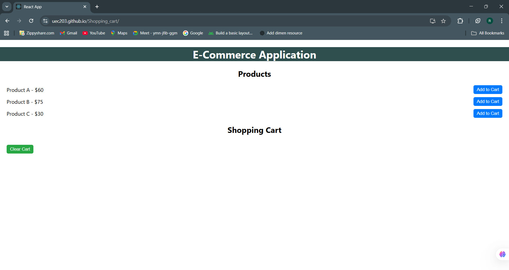

# 🛒 Shopping Cart

A simple and responsive **Shopping Cart application** built using **React.js**.  
This project demonstrates basic cart functionality such as adding, removing, and updating item quantities.

👉 **Live Demo:** [https://uec203.github.io/shopping-cart/](https://uec203.github.io/shopping-cart/)

---

## 📌 Features

- View list of products  
- Add items to the cart  
- Increase or decrease item quantity  
- Remove items from the cart  
- Display total price dynamically  
- Clean and easy-to-understand codebase  
- Responsive UI

---

## 🧰 Tech Stack

- **React.js**
- **JavaScript (ES6+)**
- **HTML5**
- **CSS3**
- **GitHub Pages** for deployment

---

## 🚀 Getting Started

Follow the steps below to run the project locally.

### 1. Clone the repository

```bash
# Clone the repository
git clone https://github.com/uec203/Shopping_cart.git

# Go to source directory
cd Shopping_cart

# Install dependencies
npm install

# Start the server
npm start

```
## Screenshoot

Here's a screenshot of the application in action:


